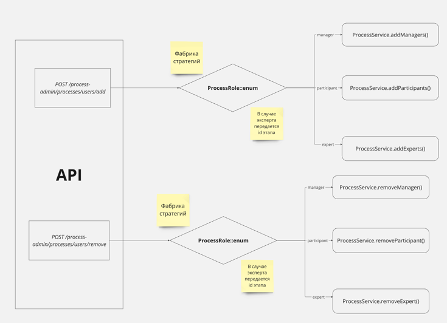

## ETU-forms

### Доска в miro

- Прототипы возможных экранных форм
- ERD
- Диаграммы процессов

<iframe width="768" height="432" src="https://miro.com/app/live-embed/uXjVLz_ZkMI=/?moveToViewport=-2703,-21086,14742,9227&embedId=346873036779" frameborder="0" scrolling="no" allow="fullscreen; clipboard-read; clipboard-write" allowfullscreen></iframe>

### Приглашение и регистрация новых пользователей

Приглашать новых пользователей может:

1. `system-admin` - приглашает системных администраторов и администраторов процессов
2. `process-admin`- приглашает участников/менеджеров/экспертов в любой процесс
3. `user`, который является менеджером процесса - приглашает участников/менеджеров/экспертов только в те процессы, за которыми он закреплен

Процесс приглашения, например за `system-admin` (для остальных ролей - аналогично):

1. `POST /system-admin/user/invite` - В результате будет отправлено письмо со ссылкой для регистрации на указанный email, в ссылку включается код активации пользователя, статус пользователя `UserStatusEnum.invited`
2. `POST /auth/sign-up` -  Ожидается пароль пользователя и код активации из ссылки, которая была в письме, после чего статус пользователя `UserStatusEnum.activated`

### Добавление/ удаление пользователя  в/из процесса

### Статусная модель процесса

`ProcessStatusEnum` 

- `draft` - процесс в состоянии черновика. В данном статусе процесс создается и находится пока его не запустили
- `inProgress` - процесс запущен. В данный статус процесс переводится после его запуска менеджером процесса и прохождении всех этапов валидации
- `test` - процесс в режиме тестирования. В данный статус процесс переводит менеджером при необходимости его тестирования (только из статуса черновика)
- `finished` - процесс завершен. Данный статус вычисляется при выполнении запросов, в базе при этом будет лежать `inPrrogress` или `finished` (если процесс был досрочно завершен руками)

Чтобы узнать текущий статус процесса необходимо воспользоваться резолвером статусов `processStatusResolver()` в `ProcessRepository`.
